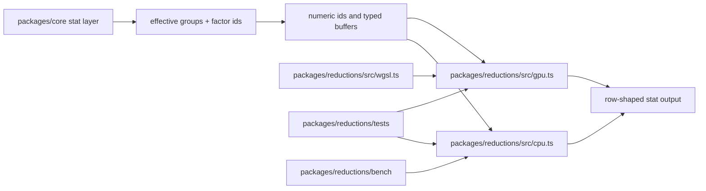

# Reductions Components

`@gggplot/reductions` is the standalone low-level package used by core stats. It
owns numeric reducer semantics over typed arrays. It does not own DataFrames,
aes mappings, factor labels, scales, geoms, or RenderTree emission.

Core stat code is responsible for ggplot semantics first: ingesting typed
columns, resolving effective groups from mapped factor aesthetics, converting
factors to ids, filtering missing numeric values, and expanding dense reducer
matrices back into row-shaped stat output. Reductions is deliberately below that
layer.

## Component Map



## Files

| File                        | Responsibility                                                   |
| --------------------------- | ---------------------------------------------------------------- |
| `src/types.ts`              | Typed input/result contracts and GPU timing metadata.            |
| `src/cpu.ts`                | CPU reference reducers and the default synchronous runtime path. |
| `src/wgsl.ts`               | WGSL shader source and dispatch/count planning helpers.          |
| `src/gpu.ts`                | Raw WebGPU execution/readback for grouped histogram reducers.    |
| `tests/reductions_test.ts`  | CPU reducer semantics and WGSL plan invariants.                  |
| `tests/gpu_test.ts`         | GPU uniform packing tests plus optional real WebGPU parity.      |
| `bench/reductions_bench.ts` | Deterministic CPU baseline timings.                              |
| `bench/gpu_bench.ts`        | WebGPU histogram timing split when an adapter is available.      |

## Reducer Inventory

| Reducer                     | CPU         | GPU package path                                  | Core usage                 |
| --------------------------- | ----------- | ------------------------------------------------- | -------------------------- |
| `groupedCount1d`            | Implemented | Same atomic pattern as histogram; no executor yet | `stat_count`               |
| `groupedHistogram1d`        | Implemented | `groupedHistogram1dGpu`                           | `stat_bin`                 |
| `groupedSummary1d`          | Implemented | Future streaming sum/count kernel                 | `stat_summary` built-ins   |
| `groupedLinearRegression1d` | Implemented | Future sum/cross-product kernel                   | `stat_smooth(method="lm")` |
| `groupedBoxplot1d`          | Implemented | CPU exact quantiles for now                       | Future `stat_boxplot`      |
| `groupedDensity1d`          | Implemented | Future grid-evaluation kernel                     | Future density/violin      |
| `groupedHistogram2d`        | Implemented | `groupedHistogram2dGpu`                           | Future 2D bins/contours    |

Current core call sites live in `packages/core/src/stat/mod.ts`:

- `stat_count` -> `groupedCount1d`
- `stat_bin` -> `groupedHistogram1d`
- `stat_summary` built-ins -> `groupedSummary1d`
- `stat_smooth({ method: "lm" })` -> `groupedLinearRegression1d`

`groupedBoxplot1d`, `groupedDensity1d`, and `groupedHistogram2d` are ready for
future grammar work, but no public geom/stat calls them yet.

## 3D boundary

The current 3D point, line, and path modes do not require new reducers: mapping
`z` changes position and rendering, not their statistical product. Existing 2D
reducers may produce a surface height or a glyph positioned at z without
becoming a distinct 3D reduction.

No `groupedHistogram3d`, volumetric density, or isosurface reducer is added yet.
Those products need an explicit voxel/volume grammar, occlusion and scale
semantics, and a renderer capable of consuming the result without compulsory CPU
readback. Once that contract exists, its canonical CPU reference and
GPU-resident implementation belong in this package under the same parity rules
as the current reducers.

## CPU/GPU Boundary

The CPU reducers are the canonical reference. GPU reducers are allowed to be
faster, but not different. A GPU implementation should:

1. Accept the same typed inputs as the CPU reducer.
2. Use the same bin and group shape rules.
3. Return the same dense count/grid layout.
4. Include timing metadata for upload, dispatch, readback, and total runtime.
5. Be optional at call sites; the grammar API must not depend on WebGPU.

For now, `packages/core` calls CPU reducers because `compile()` is synchronous.
The GPU functions are package-level primitives for browser-side pipelines, a
future async stat path, or future reducers whose outputs can remain GPU-local
for rendering, density grids, or contour extraction.

## WebGPU Execution

`src/gpu.ts` currently implements:

- `packHistogram1dParams`
- `packHistogram2dParams`
- `groupedHistogram1dGpu(device, input)`
- `groupedHistogram2dGpu(device, input)`

The executor creates storage buffers, runs the clear kernel, dispatches the
histogram kernel, reads counts back to CPU memory, and reconstructs the same
result metadata as the CPU reducer. Tests validate the uniform layouts in any
environment and run a real GPU parity test when `navigator.gpu` is available.
Set `GGGPLOT_REQUIRE_WEBGPU=1` when running `tests/gpu_test.ts` in GPU-capable
CI to make adapter absence a failure instead of a skip.

## Adding A Reducer

1. Add input/result types in `src/types.ts`.
2. Add a CPU reference in `src/cpu.ts`.
3. Add standalone tests in `tests/reductions_test.ts`.
4. Add WGSL and plan helpers if the reducer has a plausible GPU shape.
5. Add GPU executor tests for packing/layout first, then optional parity.
6. Wire `packages/core` only after the standalone package semantics are pinned.

## Benchmarking

Run:

```bash
cd packages/reductions
deno task bench
```

The benchmark currently reports CPU baselines for 100k-row count, histogram,
summary, regression, and 2D histogram workloads. GPU threshold decisions should
compare total GPU cost, including upload and readback, against these baselines.

Run GPU timing when WebGPU is available:

```bash
cd packages/reductions
deno task bench:gpu
```

The GPU script reports CPU time, total GPU time, upload, dispatch, readback, and
whether GPU counts matched CPU counts for 1D and 2D histograms.

From the repository root, validate the package plus its core integration with:

```bash
deno test -A
deno task check
```
