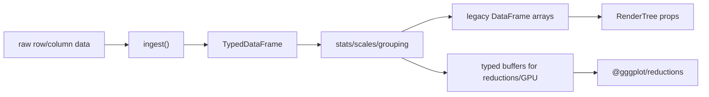

# Typed DataFrame Ingestion

This note records the typed ingestion design that started in `gggplot-3yl` and
now feeds grouping, scales, stats, compile lowering, and `@gggplot/reductions`.

## Goal

gggplot currently accepts a plain column-store object:

```ts
{ x: [1, 2, 3], group: ["a", "b", "a"] }
```

That shape is convenient, but it leaves stats and scales guessing types from raw
values. The typed ingestion boundary gives gggplot a canonical internal data
model while preserving ergonomic raw inputs.

## Types

Prototype implementation: `packages/core/src/data/mod.ts`.

```ts
type Column =
  | { type: "numeric"; values: Array<number | null> }
  | { type: "factor"; values: Array<string | null>; levels: string[] };

type TypedDataFrame = Record<string, Column>;
```

Numeric columns use `null` for missing/unparseable values. Factor columns use
`null` for missing values and keep a `levels` array for declared or first-seen
ordering.

## Accepted Input Shapes

`ingest(raw, options?)` accepts:

### Column-store

```ts
ingest({ x: [1, 2, 3], group: ["a", "b", "a"] });
```

### Row-store

```ts
ingest([
  { x: 1, group: "a" },
  { x: 2, group: "b" },
]);
```

Row-store input is normalized into first-seen column order. Missing row fields
become `null` in the typed column.

### Already Typed

Already typed data passes through unchanged. This lets later stages produce
typed stat output without round-tripping through raw inference.

## Inference

Default inference is deliberately simple:

- first non-missing number -> numeric
- first non-missing numeric string -> numeric
- first non-missing non-numeric string/object/other value -> factor
- all missing -> factor

This matches the current user-friendly behavior while making the result
explicit.

## Overrides

Two override helpers mirror the R/Gribouille escape hatch:

```ts
ingest({ cyl: [4, 6, 8] }, {
  columns: { cyl: asFactor(["4", "6", "8"]) },
});

ingest({ mpg: ["21", "22.5"] }, {
  columns: { mpg: asNumeric() },
});
```

`asFactor(levels?)` converts values to strings and preserves declared level
order before appending unseen levels. This is the fix for numeric-coded
categories such as `cyl`.

`asNumeric()` converts parseable values to numbers and stores missing or
unparseable values as `null`.

## Missing Values

Missing values are:

- `null`
- `undefined`
- empty string `""`
- unparseable numeric values when a column is numeric

Stats can decide whether to skip missing values, warn, or preserve them. GPU
lowering uses `NaN` for missing numeric values and `0xffffffff` for missing
factor ids.

## Lowering Boundary

The typed DataFrame is still a grammar/stat/scale model, not a UseGPU-native
model.



The current compiler still exposes plain array columns in `GGSpec.data`, with
typed metadata preserved as a sidecar. `legacyDataFrame()` materializes typed
columns into that transitional shape so migration can be incremental while
`columnValues()`, `numericColumnValues()`, grouping helpers, stats, scales, and
compile lowering read through typed accessors.

For reducers and future GPU paths:

- `numericBuffer(column)` lowers numeric columns to `Float32Array`, using `NaN`
  for missing values.
- `factorIds(column)` lowers factor columns to `Uint32Array`, using `0xffffffff`
  for missing values.

## Mechanical Migration Plan

The prototype has been partially migrated. Completed:

1. `ggplot(data, mapping)` and layer `data` overrides accept `InputData`.
2. The DSL ingests at the boundary and stores legacy arrays plus typed metadata
   in `GGSpec`.
3. `rowCount`, grouping, and slicing helpers operate through typed metadata and
   preserve it across slices.
4. Scale training uses factor/numeric metadata instead of string sniffing.
5. Stats consume typed accessors and call `@gggplot/reductions` for count, bin,
   summary, and linear regression.
6. Compile lowering reads mapped columns through accessors and preserves
   metadata during sort/filter paths.

Remaining:

1. Store `TypedDataFrame` directly in `GGSpec` and layer overrides.
2. Keep `legacyDataFrame()` only at final RenderTree/geom materialization
   boundaries, then remove it once all render props are lowered explicitly.
3. Delete remaining transitional coercions after the IR no longer exposes raw
   arrays.

That migration should be a separate implementation bead because it touches
nearly every pipeline stage.
